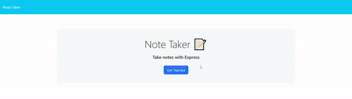

# Note Taker
An application that allows a user to quickly add notes to a tracker.

## Description
Allows a user to add notes or tasks to a website that persistantly stores the data. They can then reviews those notes at any time and delete them if they so choose.

## Table of Contents
- [Usage](#usage)
- [License](#license)
- [Questions](#questions)

## Usage
Navigate to [The application website](https://notetaker-l81g.onrender.com/)
  
Click "Get Started" to start using the application
  
The field on the right allows you to input a title for your note and underneath it a description. Once your down writing your note hit save note in the top right corner.
  
If you want to read a previous note simply click on the title on the left side
  
if you want to delete a note then click the trash can icon next to the previous note's title
  

The following video demonstrates an example user recording and deleting notes.

## License
This project is licensed under the MIT license.

## Questions
If you have any questions, please feel free to reach out to me at my GitHub: [drewhermanson](https://github.com/drewhermanson)
or by email: drew.hermanson@gmail.com
